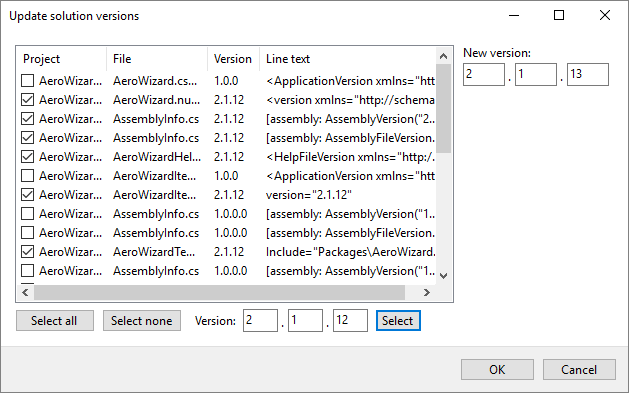

# Intentional Solution Version Editor

A Visual Studio extension that provides a means to update all version information in a solution at once including project files, assembly info, NuGet files, and extension files.

## Quick Links
* [Issues](https://github.com/dahall/IntentionalSolutionVersion/issues)

## Installation
This project is available via the Visual Studio Marketplace [(VS2017-2019)](https://marketplace.visualstudio.com/items?itemName=dahall.IntentionalSolutionVersion) / [(VS2022)](https://marketplace.visualstudio.com/items?itemName=dahall.IntentionalSolutionVersion2022), in the [Releases area](https://github.com/dahall/IntentionalSolutionVersion/releases/latest), and inside Visual Studio under "Extensions and Updates".
